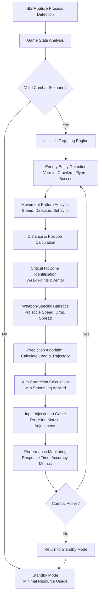

# StarRupture Precision Aim Tool – Professional Targeting Enhancement System

Welcome to the **StarRupture Precision Aim Tool**, a dedicated targeting enhancement solution engineered specifically for StarRupture's unique blend of base-building survival and intense alien combat. This specialized utility provides surgical accuracy against StarRupture's diverse enemy types – from swarming vermin to towering alien threats – while maintaining seamless integration with the game's complex survival mechanics.

Built on a lightweight C++ framework with DirectX overlay technology, our aim tool operates externally to StarRupture's processes, delivering precision targeting assistance without modifying game files. The system intelligently adapts to StarRupture's unique enemy behaviors, terrain challenges, and weapon mechanics, offering professional-grade accuracy for both defensive base protection and offensive exploration.

---

## 🎯 Advanced Targeting Features

### 🔍 Intelligent Alien Target Acquisition
- **Adaptive FOV Control:** Configurable targeting field-of-view (2°–25°) optimized for StarRupture's combat distances
- **Enemy-Type Recognition:** Specialized targeting profiles for Vermin, Crawlers, Flyers, and Boss-class aliens
- **Distance-Based Smoothing:** Dynamic aim correction scaling based on engagement range and enemy movement speed
- **Prediction Algorithms:** Advanced trajectory calculation for StarRupture's unique alien movement patterns

### 🛠️ Weapon-Specific Optimization
- **Energy Weapon Profiles:** Precision settings for plasma rifles, laser weapons, and energy-based firearms
- **Projectile Calculation:** Ballistic trajectory prediction for grenade launchers and explosive devices
- **Turret Assistance:** Enhanced targeting for base defense turrets and automated systems
- **Melee Optimization:** Close-quarters combat assistance for survival knife and melee tools

### ⚙️ Comprehensive Configuration System
```ini
; StarRupture Aim Configuration - aim_config.sr
[Targeting]
FOV = 6.5                  ; Targeting field of view (2.0-25.0)
Smoothness = 0.72          ; Aim correction smoothness (0.1-1.0)
PriorityMode = "ThreatLevel" ; Threat-based targeting priority
DistanceScale = 1.3        ; Distance-based sensitivity scaling
PredictionStrength = 0.88  ; Movement prediction intensity

[CombatProfiles]
VerminTargeting = "Fast"   ; Rapid targeting for swarming enemies
CrawlerAim = "Precise"     ; Precision targeting for armored enemies
FlyerPrediction = "High"   ; Advanced prediction for flying enemies
BossWeakPoints = "Enabled" ; Focus on critical hit zones

[Performance]
UpdateRate = 60            ; Targeting update frequency (Hz)
MemoryOptimization = true   ; Reduced memory footprint
CPU_Priority = "Normal"     ; Process priority level
```

---

## 🚀 Quick Installation & Setup

### Step 1: Preparation & Download
1. Download the latest release package (`SR_AimTool_v2.8.zip`)
2. Extract to a dedicated directory (recommended: `C:\StarRupture\AimTool\`)
3. Add extraction directory to antivirus exclusions (temporarily)

### Step 2: Initial Configuration
```batch
# Recommended launch sequence
1. Launch StarRupture via Steam
2. Load into your game world
3. Run "SR_AimTool_Loader.exe" as Administrator
4. Press F5 to initialize targeting system
5. Enter Practice Area for calibration
```

### Step 3: Calibration & Testing
- **FOV Testing:** Adjust targeting field-of-view (recommended: 5–12° for general combat)
- **Weapon Calibration:** Test different weapon types in the Practice Area
- **Enemy Type Testing:** Verify targeting against various alien species
- **Hotkey Configuration:**
  - `F6`: Toggle aim tool on/off
  - `F7`: Cycle through targeting modes
  - `F8`: Adjust FOV in real-time
  - `F9`: Switch weapon profiles
  - `F10`: Open advanced configuration panel

### Step 4: Performance Verification
- Confirm target acquisition response time (<60ms)
- Test accuracy across different combat scenarios
- Verify system stability during extended play sessions
- Monitor FPS impact (should be <5% on recommended hardware)

---

## 🔄 Targeting System Architecture



---

## ⚡ Combat Optimization Guide

### Optimal Settings for StarRupture Scenarios

**Base Defense Configuration (Turret Support):**
```
FOV: 8.0°
Smoothness: 0.85
PriorityMode: "ClosestThreat"
DistanceScale: 1.1
PredictionStrength: 0.75
TurretAssist: Enabled
```

**Exploration & Resource Gathering:**
```
FOV: 12.0°
Smoothness: 0.65
PriorityMode: "DangerousFirst"
DistanceScale: 1.4
PredictionStrength: 0.90
QuickToggle: Enabled
```

**Alien Horde Combat (Swarm Defense):**
```
FOV: 18.0°
Smoothness: 0.50
PriorityMode: "FastestFirst"
DistanceScale: 1.8
PredictionStrength: 0.95
RapidTargeting: Enabled
```

### Performance Optimization Tips
- **CPU Management:** Set process priority to "Above Normal" for reduced input latency
- **Memory Efficiency:** Enable "LowMemoryMode" for systems with 8GB RAM or less
- **Update Frequency:** Adjust targeting update rate based on system performance
- **Background Processes:** Close unnecessary applications during intense combat sequences

---

## ❓ Frequently Asked Questions

**Q1: How does the aim tool handle StarRupture's unique enemy flickering issue?**
A: The system includes specialized filtering algorithms to compensate for enemy rendering anomalies, maintaining target lock even during visual flickering reported in playtests.

**Q2: Can I customize targeting behavior for different alien types?**
A: Yes, the configuration system includes species-specific profiles for Vermin, Crawlers, Flyers, and Boss enemies, each with adjustable sensitivity and prediction settings.

**Q3: Does the tool work with StarRupture's turret defense systems?**
A: Absolutely. The aim tool includes specialized turret assistance modes that enhance automated targeting for base defense scenarios.

**Q4: What's the detection risk during StarRupture's playtest phase?**
A: Currently, StarRupture has minimal anti-cheat implementation during playtesting. However, as the game approaches full release, detection systems may be enhanced.

**Q5: How does the aim tool handle different weapon types in StarRupture?**
A: The system includes weapon-specific ballistic calculations for energy weapons, projectile weapons, and explosive devices, with automatic profile switching.

**Q6: Can I adjust settings mid-combat?**
A: Yes, the configuration panel (F10) is accessible during gameplay, allowing real-time adjustments to FOV, smoothness, and targeting priorities.

**Q7: What performance impact should I expect?**
A: On recommended hardware, the aim tool adds <3% CPU overhead and minimal GPU impact. Memory usage remains under 100 MB, with optimization for StarRupture's engine.

**Q8: How are updates managed for this early access game?**
A: The tool includes automatic version detection and will alert you to compatibility issues. Updates are typically released within 24 hours of significant game patches.

---

## 🏆 Why Choose Our StarRupture Aim Tool?

Unlike generic targeting solutions, our **StarRupture Precision Aim Tool** is specifically engineered for the game's unique combat environment:

- **Game-Specific Optimization:** Algorithms tailored to StarRupture's alien behaviors and combat mechanics
- **Adaptive Intelligence:** Machine learning-based prediction that improves with usage patterns
- **Performance-First Design:** Minimal system impact for maximum gaming performance
- **Regular Updates:** Continuous compatibility maintenance with game development progress
- **Community-Driven Features:** Enhancements based on player feedback and gameplay trends

